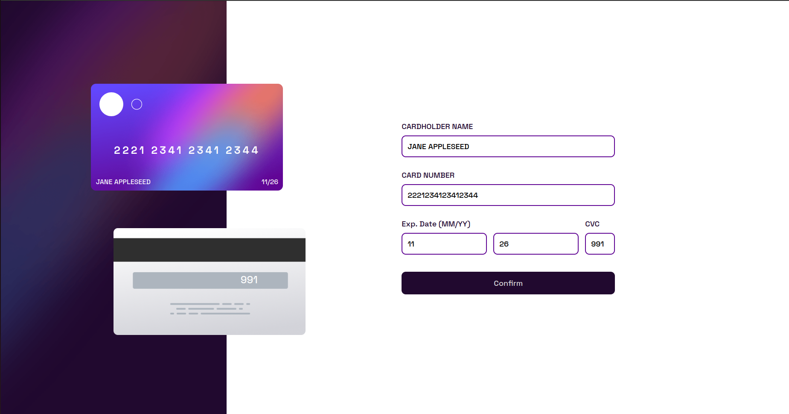

# Frontend Mentor - Interactive card details form solution

This is a solution to the [Interactive card details form challenge on Frontend Mentor](https://www.frontendmentor.io/challenges/interactive-card-details-form-XpS8cKZDWw). Frontend Mentor challenges help you improve your coding skills by building realistic projects. 

## Table of contents

- [The challenge](#the-challenge)
- [Screenshot](#screenshot)
- [Links](#links)
- [My process](#my-process)
- [Built with](#built-with)
- [Author](#author)

### The challenge

Users should be able to:

- Fill in the form and see the card details update in real-time
- Receive error messages when the form is submitted if:
  - Any input field is empty
  - The card number, expiry date, or CVC fields are in the wrong format
- View the optimal layout depending on their device's screen size
- See hover, active, and focus states for interactive elements on the page

### Screenshot

### Links

- Solution URL: [Add solution URL here](https://your-solution-url.com)
- Live Site URL: [Add live site URL here](https://your-live-site-url.com)

## My process
This was quite the hefty project. 
Started off with the webpage using HTML and SCSS. Completed the desktop version and immediately started working on the javascript part of the project. Regular expressions posed a big problem for me especially when scripting the validation for the credit card. I had to use my research skills to find the regex for the credit card validation. The others worked quite well and soon I had it up and running. I added a little more responsiveness and made it more dynamic by updating the virtual credit cards as the user wrote in his/her details. After that, I coded the completion section and then worked on the responsiveness for mobile view. This challenge was indeed quite difficult and I learnt a lot on how to manipulate pages especially validation skills. This is annoyingly fun XD.

### Built with

- Desktop-first workflow
- SASS/SCSS
- JavaScript

## Author

- Frontend Mentor - [@DennyIsNaive](https://www.frontendmentor.io/profile/DennyIsNaive)
- Twitter - [@denzelashiteyfd](https://www.twitter.com/denzelashiteyfd)

